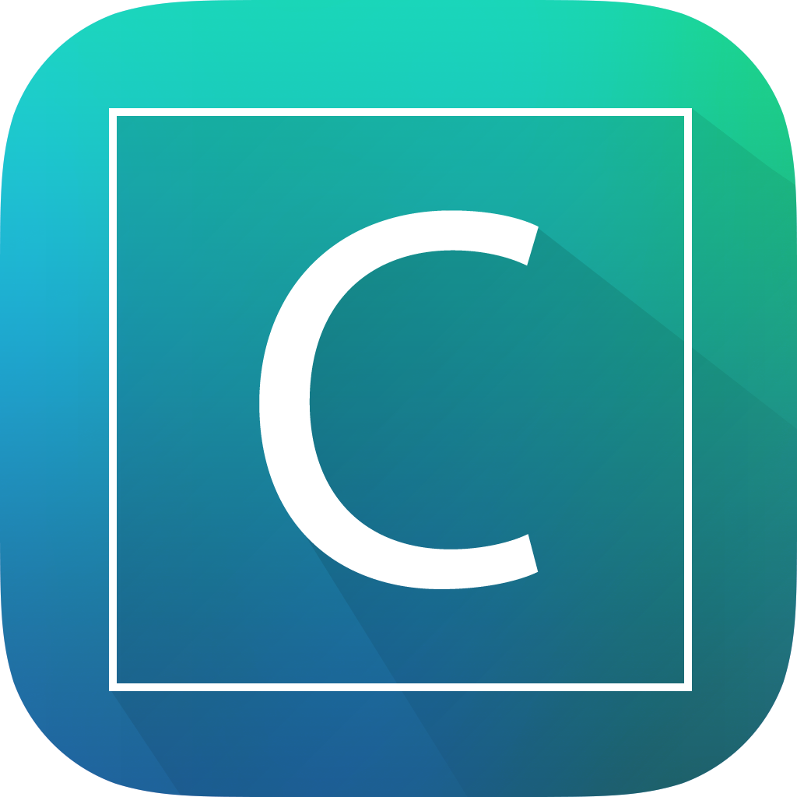

  

  <h3 align="center">Cool Keyboard</h3>

  

    A custom iOS keyboard app with predefined keyboard layouts featuring different unicode symbols.
  

    
    
    
    

## Features
- Multiple keyboard layouts with unique unicode symbols.
- Easy to use and switch between keyboard layouts.
- Compatible with all iOS devices running iOS 14 and above.

### Requirements
- Xcode 14.0+
- [Tuist](https://github.com/tuist/tuist)

## Installation
1. Clone this repository
2. Run `make`
3. Open the project in Xcode

## Usage
1. Download and install the Cool Keyboard app from the App Store.
2. Go to "Settings" > "General" > "Keyboard" > "Keyboards" > "Add New Keyboard".
3. Select "Cool Keyboard" from the list of available keyboards.
4. To switch between keyboard layouts, tap the globe icon on the bottom left corner of the keyboard.

## Keyboard Layouts
- Symbol Keyboards: A keyboard layout featuring commonly used symbols and special characters.

## License
This project is licensed under the GPL-3.0 license.
